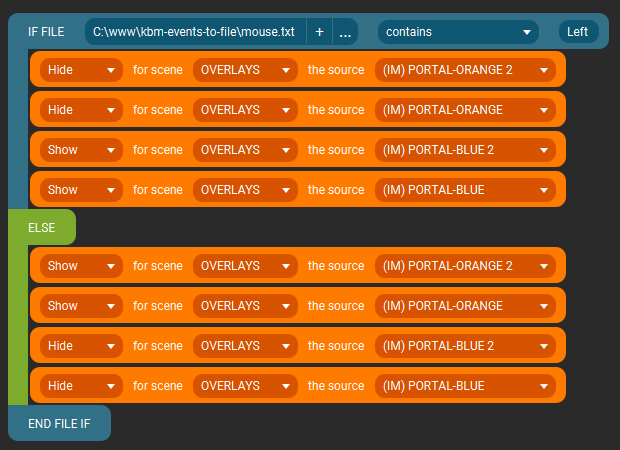

Here is where you can download most utilities apps I created/use.

<br>

# Summary

-   [Touch Portal Plugin - VoiceMeeter](#touch-portal-plugin---voicemeeter), and saving the last Event into a text file.
-   [Listening to your Mouse and Keyboard](#listening-to-your-mouse-and-keyboard), and saving the last Event into a text file.

<br />
<br />

# Touch Portal Plugin - VoiceMeeter

([Back to top](#summary))

```
✅ Windows
🚫 MacOS

🚫 Stream Deck
✅ Touch Portal
```

> Before downloading this, you'll need to have [NodeJS](https://nodejs.org/en/download/) installed.  
> It should be simple enough.

[This Touch Portal Plugin](TouchPortal-VoiceMeeter/com.mazeakin.voicemeeter.tpp) will allow you to listen to common `VoiceMeeter Events` and use `Touch Portal Sliders` for adjusting your gain (volume).

<br />
<br />

# Listening to your Mouse and Keyboard

([Back to top](#summary))

```
✅ Windows
🚫 MacOS

✅ Stream Deck
✅ Touch Portal
```

[This utility](kbm-events-to-file/) will listen to your Mouse and Keyboard, and save the last Event of both into files names `mouse.txt` and `keyboard.txt`.

That way, you can hook Stream Deck / Touch Portal Events to those files and add more depth to your overlays.

<br>

## Preview


<br>

## Before starting

Just run the app once, so it can create it's files.

<br>

## Settings

Edit the `settings.json` file, to change the following:

```json
{
    "listen_mouse_press": false, // listen to pressing mouse buttons?
    "listen_mouse_release": false, // listen to releasing mouse buttons?
    "listen_keyboard_press": false, // listen to pressing keyboard buttons?
    "listen_keyboard_release": false // listen to releasing keyboard buttons?
}
```

<br>

## Ideas

Hide/show sources based on the contents of the files (latest events).


